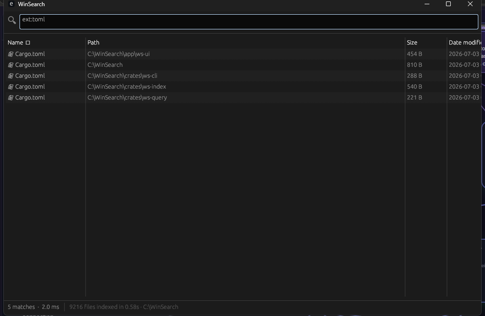
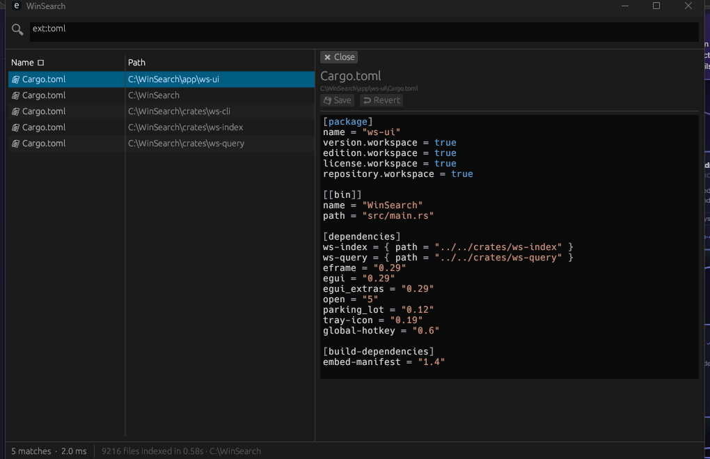

# WinSearch

[](https://github.com/STE-FalconSoftware/WinSearch/actions/workflows/ci.yml)
[](https://github.com/STE-FalconSoftware/WinSearch/releases)
[](LICENSE)


A lightning-fast file search for Windows, built from scratch in Rust. It reads
the NTFS Master File Table directly and keeps the whole index in RAM, so it can
index millions of files in seconds and answer as-you-type queries in well under
50 ms — the same approach the "Everything" tool uses.

See [PLAN.md](PLAN.md) for the full technical design.

## Screenshots

Instant search across the whole drive, filtering as you type:



Click any result to preview and edit it, with syntax highlighting and a save
guard:



## What's built

| Milestone | Status | What it delivers |
|---|---|---|
| M1 Core engine + CLI | ✅ | MFT enumeration, in-memory name arena, parallel SIMD substring search, path reconstruction |
| M2 Metadata + query language | ✅ | size/date fill, `ext:` `size:` `dm:` `dc:` `path:` `type:` globs & regex, multi-volume, non-NTFS fallback |
| M3 egui UI | ✅ | native window, as-you-type search, virtualized results, column sorting, open/reveal/copy |
| M4 Live index + persistence | ✅ | USN change-journal tailing for real-time updates, on-disk cache with journal catch-up on startup |
| M5 Raw `$MFT` parser | ✅ | names + sizes + dates decoded in one sequential pass (primary path; USN enum is the automatic fallback) |
| Tray + global hotkey | ✅ | system-tray icon, **Ctrl+Alt+Space** to summon, close-to-tray instead of quit |
| Preview / edit pane | ✅ | click a result to view it with syntax highlighting, edit in place, save with on-disk-conflict + discard-changes guards |

## Project layout

```
crates/ws-index   engine: MFT/USN enumeration, in-memory index, journal, persistence, walker
crates/ws-query   query parser + compiler + parallel search
crates/ws-cli     command-line front end (wsearch.exe)
app/ws-ui         native GUI (WinSearch.exe, egui)
```

## Download

Prebuilt Windows x64 binaries are attached to each
[release](https://github.com/STE-FalconSoftware/WinSearch/releases). Grab the
latest `WinSearch-vX.Y.Z-windows-x64.zip`, unzip, and run `WinSearch.exe`.

## Build

```powershell
cargo build --release
```

Binaries land in `target\release\`:
- `WinSearch.exe` — the GUI (ships with a manifest that requests administrator).
- `wsearch.exe` — the CLI.

## Run

The fast path reads the raw NTFS volume, which **requires administrator rights**.

**GUI** — double-click `WinSearch.exe` (Windows shows a UAC prompt), or:

```powershell
Start-Process .\target\release\WinSearch.exe -Verb RunAs
```

Closing the window minimizes it to the system tray; press **Ctrl+Alt+Space**
anywhere to bring it back, or use the tray icon's menu. Choose **Quit** from the
tray menu to exit fully.

**Preview & edit** — single-click a result to open it in the right-hand pane with
syntax highlighting (JSON, code, config, plain text). Edit it and press
**Ctrl+S** (or the Save button) to write it back. If the file changed on disk
since you opened it, you're asked to confirm before overwriting; switching or
closing with unsaved edits prompts first. Binary files and files over 4 MB show
a notice instead of loading. Double-click still opens a file in its default app.

**CLI** — from an elevated terminal:

```powershell
.\target\release\wsearch.exe                 # interactive REPL over all NTFS drives
.\target\release\wsearch.exe "report *.pdf"  # one-shot query
.\target\release\wsearch.exe --bench          # index + timing benchmark
.\target\release\wsearch.exe --verify-mft C   # cross-check raw MFT vs Win32 API
```

`--verify-mft` samples ~5000 files, decodes their size/timestamps from the raw
`$MFT`, and compares each against `GetFileInformationByHandle`. All-match means
the raw fast path is decoding correctly on your machine. (A handful of mismatches
usually just means those files changed during the scan.)

**Keyboard** — ↑/↓ move the selection, **Enter** opens the highlighted file in
the preview pane, **Esc** closes the pane, **Ctrl+S** saves.

### No admin? Index a single folder

The CLI, the GUI, and the engine can all index one directory subtree with no
privileges (a parallel directory walk). Handy for testing or scoped searches:

```powershell
.\target\release\wsearch.exe --root C:\Users\me\projects "ext:rs main"

# The GUI takes the same flag (or the WS_ROOT environment variable):
.\target\release\WinSearch.exe --root C:\Users\me\projects
```

## Query syntax

| Example | Matches |
|---|---|
| `report q3` | names containing both words (ANDed) |
| `*.pdf` / `ext:pdf,docx` | by extension |
| `report_q?.pdf` | `*` / `?` wildcards on the name |
| `size:>100mb` `size:1kb..1mb` | by size (`b kb mb gb tb`) |
| `dm:today` `dm:>2026-06-01` `dm:last7d` | by date modified |
| `dc:2026-06-01..2026-06-30` | by date created |
| `path:projects` | substring on the full path |
| `type:dir` / `type:file` | only folders / only files |
| `re:^inv_\d+` | regex on the name |
| `"my report"` | quoted phrase (keeps spaces together) |

Filters combine, so `ext:log size:>10mb dm:today path:service` is one query.

## How the speed works

1. **Raw `$MFT` read**: the Master File Table is read straight off the volume in
   large sequential blocks and decoded in one pass — names, sizes, and
   timestamps together, no directory traversal and no per-file `stat`. (If the
   raw parse ever fails, it falls back automatically to `FSCTL_ENUM_USN_DATA`
   for names plus a parallel metadata fill. Force the fallback with the
   `WS_NO_MFT=1` environment variable.) A small fraction of files describe their
   data through an NTFS *attribute list* that lives outside their base record;
   the raw parser can't size those, so the index backfills just them from the
   Win32 API — a targeted repair, not a full re-scan.
2. **In-memory index**: names live in one contiguous byte arena; entries are a
   flat array; full paths are reconstructed on demand only for displayed rows.
3. **Parallel search**: rayon splits the entry array across all cores and each
   name is tested with a SIMD-assisted case-insensitive substring scan.
4. **Live updates**: the USN change journal is tailed every ~700 ms, so the
   index stays current with near-zero overhead.
5. **Warm startup**: the index is cached to
   `%LOCALAPPDATA%\WinSearch\index.bin`; on next launch it loads instantly and
   replays only what changed since, via the journal.

## Tests

```powershell
cargo test
```

Tests cover the matcher, the full query grammar, size/date filtering, path
reconstruction, and the cache round-trip — all via the privilege-free walk
indexer, which exercises the same search/index/persistence code as the MFT path.
